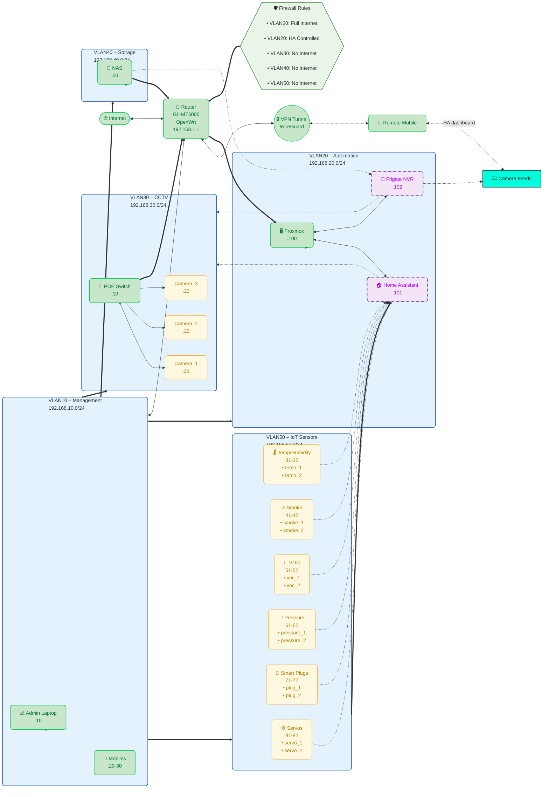

![[network-diagram-new.png]]

## Document References & Architecture  
- **Architecture Decision:** [[docs/decisions/01-network-architecture|Network Architecture]] - Design rationale  
- **Firewall Implementation:** [[configs/openwrt/firewall-config-readable|Firewall Config]] - Security rules for this topology
- **Project Context:** session file deep-archived - Original design session

## Configuration Dependencies
This network diagram drives the configuration requirements for:
- [[configs/openwrt/vlan-config.conf]] - VLAN interface setup (pending)
- [[configs/openwrt/main-config.conf]] - Router configuration (pending)
- [[configs/home-assistant/configuration.yaml|HA Configuration]] - HA VLAN 20 integration (pending)  
- [[configs/frigate/config.yml|Frigate Configuration]] - NVR VLAN 30 configuration (pending)
- [[configs/esphome/printairpipe-controller.yaml|PrintAirPipe Controller]] - IoT VLAN 50 sensors (pending)

## Implementation Status
- ✅ **Network Architecture** - 4-VLAN design complete per [[docs/decisions/01-network-architecture|Network Architecture Decision]]
- ✅ **Security Rules** - Firewall policies defined in [[configs/openwrt/firewall-config-readable|Firewall Config]]
- 🚧 **Router Setup** - VLAN interfaces pending configuration  
- 🚧 **Device Assignment** - IP allocation per diagram specifications pending

**Next Implementation:** Configure VLAN interfaces using [[configs/openwrt/vlan-config.conf]]

