![[Network Diagram - New.png]]

```mermaid
flowchart LR

%% ─── VLANs ──────────────────────────────────────
subgraph VLAN10["VLAN10 – Management<br>192.168.10.0/24"]
  direction TB
  Admin["💻 Admin Laptop<br>.10"]
  Mobile["📱 Mobiles<br>.20-30"]
end

subgraph VLAN30["VLAN30 – CCTV<br>192.168.30.0/24"]
  direction TB
  POESwitch["🔌 POE Switch<br>.10"]
  Cam1["Camera_1<br>.21"]
  Cam2["Camera_2<br>.22"]
  Cam3["Camera_3<br>.23"]
end

subgraph VLAN40["VLAN40 – Storage<br>192.168.40.0/24"]
  direction TB
  NAS["🍓 NAS<br>.50"]
end

subgraph VLAN50["VLAN50 – IoT Sensors<br>192.168.50.0/24"]
  direction TB
  Temp["🌡 Temp/Humidity<br>31-32<br>• temp_1<br>• temp_2"]
  Smoke["🔥 Smoke<br>41-42<br>• smoke_1<br>• smoke_2"]
  VOC["🧪 VOC<br>51-52<br>• voc_1<br>• voc_2"]
  Pressure["📏 Pressure<br>61-62<br>• pressure_1<br>• pressure_2"]
  Plug["🔌 Smart Plugs<br>71-72<br>• plug_1<br>• plug_2"]
  Servo["⚙️ Servos<br>81-82<br>• servo_1<br>• servo_2"]
end

subgraph VLAN20["VLAN20 – Automation<br>192.168.20.0/24"]
  direction TB
  Proxmox["🖥 Proxmox<br>.100"]
  HA["🏠 Home Assistant<br>.101"]
  Frigate["🎥 Frigate NVR<br>.102"]
end

%% Core / Firewall
Internet(["🌐 Internet"]) <--> Router["🛜 Router<br>GL-MT6000<br>OpenWrt<br>192.168.1.1"]
Router <--> VPN(("🔒 VPN Tunnel<br>WireGuard"))
Router ==> Proxmox
Router === n1{{"🛡 Firewall Rules<br>
• VLAN20: Full Internet<br>
• VLAN20: HA Controlled<br>
• VLAN30: No Internet<br>
• VLAN40: No Internet<br>
• VLAN50: No Internet"}}

%% ─── Links ──────────────────────────────────────
VLAN10 --> Admin & Mobile
VLAN10 ==> VLAN30 & VLAN50 & VLAN40 & VLAN20
VLAN10 <--> Router

VLAN30 --> POESwitch
POESwitch --> Cam1 & Cam2 & Cam3

VLAN40 --> NAS

VLAN20 --> Proxmox
Proxmox <--> HA & Frigate

HA -.-> VLAN30
VPN <-.-> Remote["📲 Remote Mobile"]
Remote <-. "HA dashboard" .-> CameraFeeds["🎞 Camera Feeds"]

Plug -.-> HA
Pressure -.-> HA
VOC -.-> HA
Servo -.-> HA
Smoke -.-> HA
Temp -.-> HA

Frigate -.-> CameraFeeds & VLAN30
NAS ==> Router
POESwitch ==> Router
VLAN50 ==> HA
NAS -.-> Frigate

%% ─── Classes ────────────────────────────────────
classDef vlan fill:#e3f2fd,stroke:#0d47a1,stroke-width:1.5px,rx:8,ry:8
classDef security fill:#e8f5e8,stroke:#2e7d32,stroke-width:1.5px,rx:8,ry:8
classDef sensor fill:#fff8e1,stroke:#ff9800,stroke-width:1px,rx:8,ry:8,color:#af8000
classDef device fill:#C8E6C9,stroke:#00C853,stroke-width:1.5px,rx:8,ry:8,color:#007531
classDef VM stroke-width:2px,stroke-dasharray:2,stroke:#4a148c,fill:#f3e5f5,color:#AA00FF
classDef DataFeed fill:#00ffdd,stroke-width:1px,stroke:#000

class VLAN10,VLAN20,VLAN30,VLAN40,VLAN50 vlan
class n1 security
class Admin,Mobile,NAS,Proxmox,HA,Frigate,Internet,Router,VPN,Remote,POESwitch device
class Temp,Smoke,VOC,Pressure,Plug,Servo,Cam1,Cam2,Cam3 sensor
class HA,Frigate VM
class CameraFeeds DataFeed
```

## Document References & Architecture  
- **Architecture Decision:** [[docs/decisions/001-network-architecture]] - Design rationale  
- **Firewall Implementation:** [[configs/openwrt/firewall-config.sh]] - Security rules for this topology
- **Project Context:** [[docs/session-states/session_state_20250909]] - Original design session

## Configuration Dependencies
This network diagram drives the configuration requirements for:
- [[configs/openwrt/vlan-config.conf]] - VLAN interface setup (pending)
- [[configs/openwrt/main-config.conf]] - Router configuration (pending)
- [[configs/home-assistant/configuration.yaml]] - HA VLAN 20 integration (pending)  
- [[configs/frigate/config.yml]] - NVR VLAN 30 configuration (pending)
- [[configs/esphome/printairpipe-controller.yaml]] - IoT VLAN 50 sensors (pending)

## Implementation Status
- ✅ **Network Architecture** - 4-VLAN design complete per [[docs/decisions/001-network-architecture]]
- ✅ **Security Rules** - Firewall policies defined in [[configs/openwrt/firewall-config.sh]]
- 🚧 **Router Setup** - VLAN interfaces pending configuration  
- 🚧 **Device Assignment** - IP allocation per diagram specifications pending

**Next Implementation:** Configure VLAN interfaces using [[configs/openwrt/vlan-config.conf]]